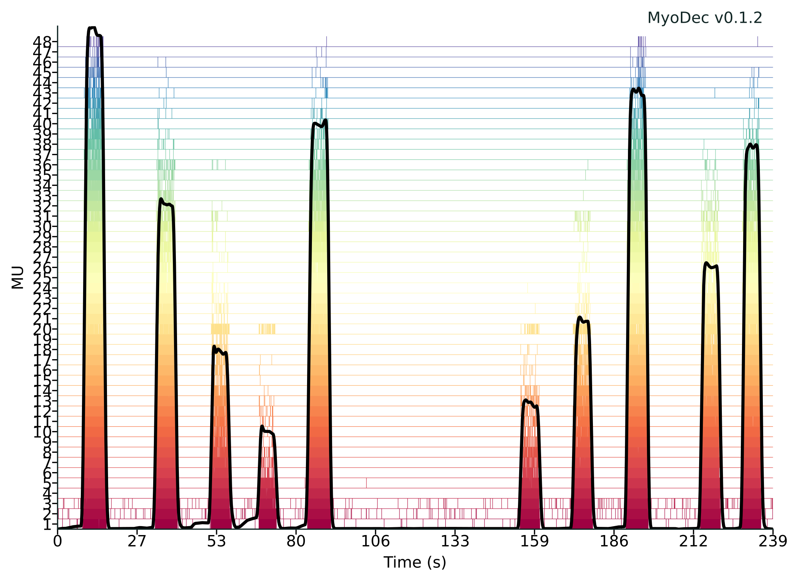

# MyoDec v0.1.

This repository contains source code for MyoDec sEMG decomposition software v0.1.

1. [Introduction](#introduction)
2. [Requirememts](#requirememts)
4. [Usage example](#usage-example)
    1. [In Python](##in-python)
    2. [Using windows app](##using-windows-app)

# Introduction

Non-stationary surface electromyography (sEMG) decomposition using Blind Source Separation (BSS) can be challenging due to amplitude changes in sEMG signals and motor unit (MU) firing frequency variations. While variable-force sEMG data can be decomposed by splitting data into stationary segments (decompose on plateau) or updating filters, we needed an alternative solution for estimating MU numbers and activation patterns. This led to the development of MyoDec.

MyoDec's ARM algorithm attempts to provide a BSS-based solution for non-stationary variable-force sEMG data decomposition using amplitude features. MyoDec aims to model MU behavior through a set of normalized, unique, highly-regular amplitude features (inherently present in sEMG data), enabling MU activity identification during variable force contractions (as shown in Fig. 1). We hope you find this approach interesting and user-friendly.


*Figure 1. Variable force sEMG data decomposition results using MyoDec ARM*

# Requirememts
See ```requirements.txt```

Decomposition was tested on Ubuntu 22.04 LTS with Python 3.12:

```
numpy==1.26.4
scipy==1.15.1
pandas==2.2.3
sklearn==1.6.1
matplotlib==3.10.0
seaborn==0.13.2
openpyxl==3.1.5
PyWavelets==1.8.0
```

# Usage example

## In Python

See the example: ```example/0-decomposition-example.ipynb```

## Using windows app

1. On Windows OS
2. Consult ```User's Guide MyoDec v0.1.pdf```
3. Try out the example in the ```app/``` directory